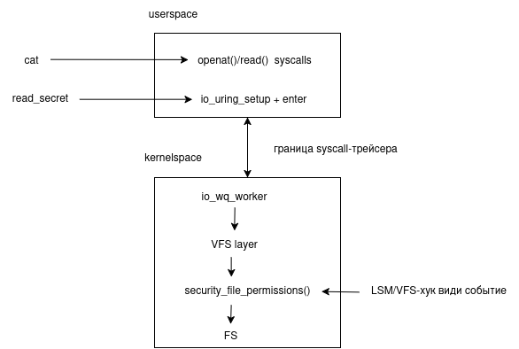

- [Falco/Tetragon](#falcotetragon)
  - [Требования к стенду](#требования-к-стенду)
  - [Подготовка образов](#подготовка-образов)
    - [1. Pod A](#1-pod-a)
    - [2. Pod B](#2-pod-b)
  - [Установка Falco и tetragon](#установка-falco-и-tetragon)
    - [Falco](#falco)
    - [Tetragon](#tetragon)
  - [Демонстрация](#демонстрация)
    - [Стоковый Falco](#стоковый-falco)
    - [Tetragon с "наивной" политикой](#tetragon-с-наивной-политикой)
    - [Реакция Tetragon на VFS-функции](#реакция-tetragon-на-vfs-функции)
  - [Результаты](#результаты)
  - [Анализ](#анализ)
  - [Remediation](#remediation)
  - [Очистка кластера](#очистка-кластера)

# Falco/Tetragon

## Требования к стенду

- Локальный k3s-кластер (или любой другой Kubernetes 1.27+)
  
- Linux kernel 5.10+, `kernel.io_uring_disabled` равен `0` или `1`
  
  Проверить можно командой

  ```bash
  sysctl kernel.io_uring_disabled
  ```

  Если вернёт `2`, то выставляем нужное значение через
  
  ```bash
  sudo sysctl -w kernel.io_uring_disabled=0
  ```

## Подготовка образов

### 1. Pod A

Моделируем ситуацию, когда атакующий закинул свой инструмент в работающий контейнер.

Используется стандартный образ Ubuntu 22.04

```bash
kubectl run test-pod-io-uring --image=ubuntu:22.04 --privileged --command -- sleep infinity
```

Собираем и кладём бинарь

```bash
gcc -O2 -o read_secret read_secret.c -luring

kubectl cp read_secret test-pod-io-uring:/tmp/read_secret

kubectl exec test-pod-io-uring -- chmod +x /tmp/read_secret
```

### 2. Pod B

Моделируем ситауцию, когда атакующий скомпрометировал supply chain и сделал mailicious-образ.

```bash
docker build -t bad-app:latest -f Dockerfile .
```
```bash
kubectl run test-pod-baked --image=bad-app:latest --privileged --image-pull-policy=Never --command -- sleep infinity
```

Проверить, что оба запустились:
```bash
kubectl get pods test-pod-io-uring test-pod-baked
```

## Установка Falco и tetragon

### Falco

```
helm repo add falcosecurity https://falcosecurity.github.io/charts

helm repo update

helm install falco falcosecurity/falco -n falco --create-namespace -f falco/values.yaml; kubectl -n falco rollout status ds/falco
```

### Tetragon

```
helm repo add cilium https://helm.cilium.io

helm repo update

helm install tetragon cilium/tetragon -n kube-system; kubectl -n kube-system rollout status ds/tetragon
```

## Демонстрация

### Стоковый Falco

В отдельном терминале отслеживаем логи Falco:

```bash
kubectl -n falco logs -f -l app.kubernetes.io/name=falco -c falco
```

В вторм терминале три сценария:

- обычный openat

```bash
kubectl exec -it test-pod-io-uring -- cat /etc/shadow
```

- io_uring + бинарь загруженный отдельно

```bash
kubectl exec -it test-pod-io-uring -- /tmp/read_secret
```

- io_uring + бинарь добавленный при сборке образа

```bash
kubectl exec -it test-pod-baked -- /usr/local/bin/read_secret
```

Эталонный вывод:

| Прогон | Что Falco пишет |
|---|---|
| 1) `cat /etc/shadow` | `Warning Sensitive file opened for reading by non-trusted program ... process=cat ... file=/etc/shadow` |
| 2) `/tmp/read_secret` | `Critical Executing binary not part of base image ... exe_flags=EXE_WRITABLE\|EXE_UPPER_LAYER` |
| 3) `/usr/local/bin/read_secret` | (тишина) |

### Tetragon с "наивной" политикой

В отдельном терминале отслеживаем логи tetragon:

```bash
kubectl -n kube-system exec ds/tetragon -c tetragon -- tetra getevents -o compact -e PROCESS_KPROBE
```

Tetragon умеет хукать `sys_openat` через `kprobe`.

Применим такую политику

```bash
kubectl apply -f ./tetragon/policy-naive-openat.yaml
```

Повторяем два сценария:

```bash
kubectl exec test-pod-baked -- cat /etc/shadow
```
```bash
kubectl exec test-pod-baked -- /usr/local/bin/read_secret
```

"Выхлоп" будет только для `cat`

```
📬️ openat default/test-pod-baked /usr/bin/cat /etc/shadow
```

### Реакция Tetragon на VFS-функции

Хукаем `security_file_permission` - LSM-функция, вызываемая из VFS read/write-пути. 

Через VFS ходят и обычный `read()` и `io_wq`-воркер.

```bash
kubectl delete -f ./tetragon/policy-naive-openat.yaml
```
```bash
kubectl apply  -f ./tetragon/policy-lsm-file-open.yaml
```

Можно проверить, что политика загрузилась

```bash
kubectl -n kube-system logs ds/tetragon -c tetragon --tail=20 | grep -iE 'file-monitoring|error|failed'
```

Повторяем два сценария:

```bash
kubectl exec test-pod-io-uring -- cat /etc/shadow
kubectl exec test-pod-baked    -- /usr/local/bin/read_secret
```

Пример вывода:

```bash
📚 read    default/test-pod-io-uring /usr/bin/cat /etc/shadow
📚 read    default/test-pod-io-uring /usr/bin/cat /etc/shadow
📚 read    default/test-pod-io-uring /usr/bin/cat /etc/shadow
📚 read    default/test-pod-io-uring /usr/bin/cat /etc/shadow
📚 read default/test-pod-baked /usr/local/bin/read_secret /etc/shadow
📚 read default/test-pod-baked /usr/local/bin/read_secret /etc/shadow
```

## Результаты

| Детектор | Комментарии | `cat` | `read_secret` (внешний) | `read_secret` (в образе) |
|---|---|---|---|---|
| Стоковый Falco | `Read sensitive file untrusted` | + | - | - |
| Стоковый Falco | `Executing binary not part of base image` | null | +/- | - |
| Tetragon | Native (`sys_openat`) | + | - | - |
| Tetragon | LSM ( `security_file_permission`) | + | + | + |

## Анализ

Упрощённая схема



Всё, что хукает "выше" границы syscall-трейсера (например, kprobe на `sys_*`, seccomp-фильтр) не видит `io_uring`.

Всё, что хукает "ниже" syscall-трейсера (например, LSM-функции `security_*`, VFS-функции `vfs_*`, BPF-LSM) фиксирует всё вне зависимости от того как попали из userspace.

| Детектор | Комментарии | Хук | Почему **видит** | Почему **не видит** |
|---|---|---|---|---|
| Стоковый Falco | `Read sensitive file untrusted` | syscall-трейсер на `openat`/`open`/`openat2`, фильтр по `fd.name` и `fd.num>=0` | `cat /etc/shadow` вызывает `openat` | `read_secret` в userspace вызывает только `io_uring_setup` и `io_uring_enter`. `openat` исполняется через kernel-worker `io_wq`, syscall-трейсер не получает событие, поэтому правила, ждущие `openat`/`open`, молчат. |
| Стоковый Falco | `Executing binary not part of base image` | syscall-трейсер на `execve`, флаг `EXE_UPPER_LAYER` от ядра | Бинарь `read_secret` "приехал" через `kubectl cp` и лежит в верхнем слое overlayfs. На `execve` ядро ставит флаг `EXE_UPPER_LAYER`, Falco видит флаг и кидает Critical. | Так как `read_secret` являтся частью образа, то флага `EXE_UPPER_LAYER` нет. |
| Tetragon | `sys_openat` | kprobe "висит" на функции syscall-уровня `__x64_sys_openat` и `do_sys_openat2` | `cat` вызывается через тот же syscall-механизм, kprobe ловит. | `read_secret` дёргает `io_wq`, который делает open через VFS-слой, минуя syscall-обёртку. Функция `sys_openat` не вызывается, поэтому kprobe молчит. |
| Tetragon | `security_file_permission` | kprobe "висит" на VFS-функции, которая вызывается внутри ядра при каждой попытке чтения/записи файла | `cat` дёргает `openat` -> `read`, запрос в ядро идёт через VFS, по дороге дёргает `security_file_permission`. |  `read_secret` (является частью образа): `io_wq` при исполнении `IORING_OP_READ` идёт через тот же VFS-путь и дёргает `security_file_permission`. |

## Remediation

1. **Запрет io_uring**

    Выставить `kernel.io_uring_disabled=2` или или блокировать `io_uring_setup` через seccomp.

2. **Tetragon/KubeArmor с VFS- или LSM-хуками**

    Можно отслеживать `security_file_open`, `security_file_permission`, `security_socket_connect`, `security_inode_unlink` и т.д. Требует собственного поддерживаемого набора политик и ресурсов на их сопровождение.

3. **Использование AppArmor/SELinux**

    Ограничивает доступ к файлам независимо от того, как до них "дотягивается" процесс.

4. **Allowlist образов**

    Всё понятно и просто, но сложно отслеживать и могут попасть в список случайные.

## Очистка кластера

```bash
kubectl delete -f ./tetragon/policy-lsm-file-open.yaml --ignore-not-found; kubectl delete -f ./tetragon/policy-naive-openat.yaml  --ignore-not-found; kubectl delete pod test-pod-io-uring test-pod-baked --ignore-not-found

helm uninstall tetragon -n kube-system; helm uninstall falco -n falco
```
